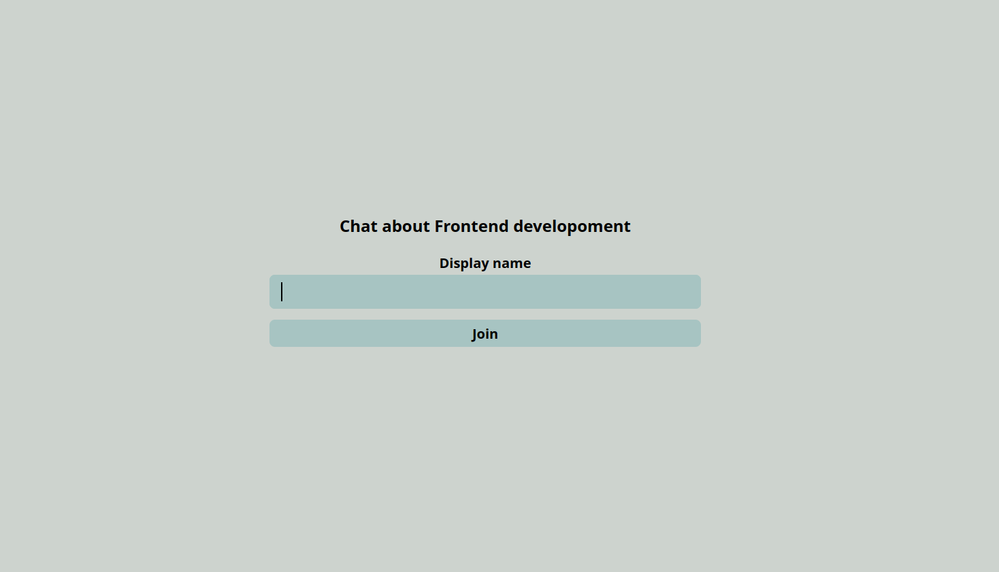

# chat-app

Real-time chat application using JavaScript, React, SCSS, and Scaledrone.

Developed as part of Algebra's Frontend developer course.

[**Try the app on netlify**](https://filip-seminarski-chat-app.netlify.app/)

## Getting started

**Requirements**

- Node.js 18.3.0+
- npm 8.12.2+
- Scaledrone channel ID

**First steps**

1. Clone this repository
2. Run `npm install`
3. Run `npm start`

## Scripts

### `npm run start`

Start the development environment.

### `npm run build`

Build the project for production.

## Features

- [x] Send messages in real time
- [x] Memeber is identified by avatar color and inicials
- [x] App is hosted on github repository
- [ ] "Typing..." indicator
